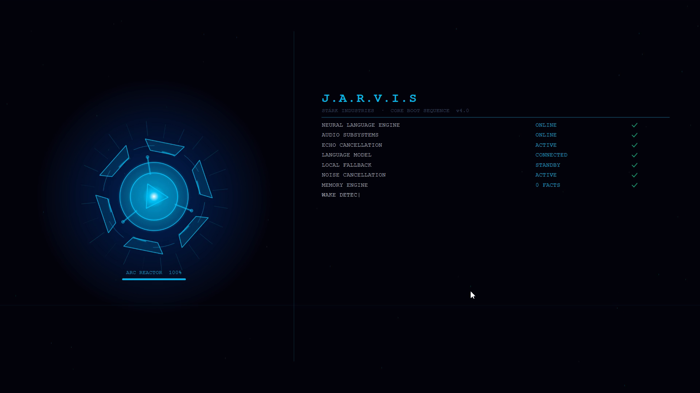

# J.A.R.V.I.S — Personal AI for Windows

> *Just A Rather Very Intelligent System* — A fully voice-activated personal AI assistant that lives on your desktop. Cinematic Iron Man HUD, dual personas (JARVIS & Friday), 6-way LLM routing, emotion awareness, autonomous agents, and more.


---

## Boot Sequence

<p align="center">
  
  
</p>

The cinematic 7-second boot plays on every launch — arc reactor charges from purple → cyan, then the typewriter checklist confirms each subsystem online before JARVIS greets you by name.

---

## What is this?

JARVIS is a **local-first** Windows AI assistant modelled after the one from the Iron Man films. It listens for your voice, understands context, controls your PC, and talks back — all from a glowing HUD in the corner of your screen.

It ships with two voice personas you can switch at any time by clicking the center circle of the HUD:

| Persona | Voice | Character |
|---------|-------|-----------|
| **JARVIS** | ElevenLabs `eleven_turbo_v2_5` — deep, precise British male | Formal, dry wit, classic AI butler |
| **Friday** | ElevenLabs `eleven_multilingual_v2` — warm Irish female | Warmer, more conversational, Tony's second AI |

Both personas respond to the same commands. Friday uses the multilingual model even in English mode, giving her a more natural, expressive tone.

---

## AI Pipeline

```
Voice → faster-whisper (local STT, base.en ~150 MB)
      → Groq llama-3.3-70b (primary, 4s timeout)
        ↳ Gemini 2.0 Flash  (long-context fallback, 2M token window)
          ↳ NVIDIA NIM       (reasoning-heavy tasks — code, analysis)
            ↳ OpenRouter     (multi-model safety net)
              ↳ Ollama llama3.2 (fully offline last resort)
      → Tool calling (50+ tools, native Groq format)
      → Filler speech (zero-latency: "Give me a moment" plays instantly)
      → Sentence-streaming TTS (speaks first sentence while generating the rest)
      → ElevenLabs / Kokoro / Chatterbox / SAPI5 TTS chain
```

### LLM Routing Intelligence

The router picks automatically based on the request type:

| Request type | Provider chosen |
|---|---|
| Conversational / tool calls | Groq (fastest) |
| Long documents, summaries (>3 000 chars context) | Gemini Flash |
| Indian language input / output | Sarvam → Groq → Ollama |
| Code, debugging, step-by-step reasoning | NVIDIA NIM → Groq |
| All others cascade in order | Groq → Gemini → NVIDIA → OpenRouter → Ollama |

---

## Architecture

```
jarvis/
│
├── main.py                    # Entry point — wires all subsystems, Qt event loop
├── config.py                  # Loads / saves %APPDATA%/JARVIS/config.json
├── monitor.py                 # System stats (CPU, RAM, battery, network)
├── sounds.py                  # Pure-tone audio feedback (no audio files needed)
├── tray.py                    # System tray icon with right-click menu
├── wake_word.py               # Always-on wake word detection (tiny.en Whisper)
├── terminal_input.py          # Typed command input with /hindi /english /status
│
├── brain/
│   ├── llm_router.py          # 6-way LLM cascade: Groq→Gemini→NVIDIA→OpenRouter→Sarvam→Ollama
│   ├── brain.py               # Tool calling, ReAct loop, streaming, response filtering
│   └── language_switch.py     # Runtime Hindi↔English detection and persona sync
│
├── audio/
│   ├── tts_engine.py          # Unified TTS: Chatterbox→Kokoro→ElevenLabs→SAPI5 (EN), ElevenLabs→Sarvam→SAPI5 (HI)
│   ├── stt_engine.py          # STT: faster-whisper (local) or Sarvam streaming
│   ├── elevenlabs_client.py   # ElevenLabs REST streaming (PCM, no MP3 decoder needed)
│   ├── chatterbox_client.py   # Chatterbox voice cloning from WAV sample (~400ms)
│   ├── kokoro_client.py       # Kokoro-82M ONNX — bm_george British male (~80ms)
│   ├── sarvam_client.py       # Sarvam bulbul:v3 — Indian female streaming TTS
│   ├── listener.py            # Double-clap biometric detection (RMS + timing signature)
│   ├── noise_pipeline.py      # rnnoise/noisereduce → WebRTC VAD → WASAPI echo gate
│   ├── noise_suppress.py      # RNNoise wrapper with pass-through fallback
│   ├── echo_cancel.py         # WASAPI loopback echo gate (prevents mic picking up TTS)
│   ├── pipeline.py            # Mic chunk processor (noise → VAD, 30ms frames)
│   ├── turn_detector.py       # State machine: IDLE→SPEAKING→PROCESSING (interrupts TTS)
│   ├── vad.py                 # Silero VAD (neural, tuned to 0.45 for Indian accents)
│   ├── filler.py              # Intent-aware filler speech ("Working on it", "One moment")
│   └── conversation_state.py  # Follow-up question state machine (up to 4 turns)
│
├── memory/
│   ├── memory_engine.py       # Cross-session facts, relationship level (0–5), SQLite
│   └── conversation_engine.py # Session log, unresolved threads, yesterday's context
│
├── personality/
│   ├── conversation_engine.py # Forbidden phrases filter, dry-wit filler bank
│   └── initiator.py           # Proactive speech: battery alerts, morning briefing, context
│
├── awareness/
│   ├── context_engine.py      # Screen OCR every 60s → LLM activity summary
│   └── emotion_engine.py      # Voice pitch + webcam FER → tone adaptation
│
├── agent/
│   ├── autonomous_agent.py    # Multi-step research, up to 8 chained actions
│   └── task_chain.py          # Named chains: morning briefing, work mode, end-of-day
│
├── meeting/
│   └── meeting_assistant.py   # Detects Teams/Zoom, transcribes, action items, focus timer
│
├── tools/                     # 50+ tools the LLM can call
│   ├── system.py              # App open/close, keyboard, volume, screenshot, OCR, Python REPL
│   ├── files.py               # File CRUD (delete → Recycle Bin safely)
│   ├── web.py                 # DuckDuckGo, weather (Open-Meteo), news, live scores, stocks, translate
│   ├── pa.py                  # Timers, notes, reminders, media control, contacts, IP
│   ├── utils.py               # Calculator, datetime, clipboard
│   ├── email_tool.py          # Draft, send, read, search, reply emails
│   ├── meeting.py             # Start/end meetings, agendas, action items, interview mode, focus timer
│   ├── presenter.py           # Voice-driven PowerPoint/PDF presenter (auto-narrate slides)
│   └── browser_control.py     # Playwright voice-driven browser (open URL, search, click)
│
└── ui/
    ├── hud.py                 # 380×380 five-layer animated HUD (60 fps QPainter)
    ├── conversation_panel.py  # Typewriter conversation panel below HUD
    ├── boot_sequence.py       # Cinematic 7-second boot (arc reactor + typewriter checklist)
    ├── war_room.py            # Full-screen second-monitor dashboard + world map
    └── theme.py               # All colours, fonts, layout constants
```

---

## Features

### Dual Personas — JARVIS & Friday

Click the **center circle** of the HUD to toggle between JARVIS and Friday mid-conversation. The switch is instant — voice, personality, and TTS model all change together.

```
[JARVIS] → "All systems nominal, sir."
[Friday] → "Friday here, sir."
```

Friday speaks using ElevenLabs `eleven_multilingual_v2` even in English mode, giving her a warmer, more expressive Irish tone compared to JARVIS's clipped British precision.

For Hindi conversations, both personas use the ElevenLabs Hindi voice (`eleven_multilingual_v2` with `elevenlabs_hindi_voice_id`) as primary, falling back to Sarvam `bulbul:v3`.

### Voice Activation

| Method | How |
|--------|-----|
| Wake word | Say **"Hey JARVIS"**, **"JARVIS"**, **"Hey Travis"**, or **"OK JARVIS"** |
| Double clap | Two claps with biometric timing validation (confidence scored 0–1) |
| Push to talk | Hold **Ctrl+Space** |
| Terminal | Type directly in the terminal window (also supports `/hindi`, `/english`, `/status`) |

### HUD States

The 380×380 HUD renders at 60 fps with five composited QPainter layers:

| State | Visual |
|-------|--------|
| **Idle** | Slow breathing bloom, rotating orbit ring, concentric arcs |
| **Listening** | 24 radial bars animate with mic RMS, radar sweep active |
| **Thinking** | 4-segment spinning arcs (purple), orbit ring pulses |
| **Speaking** | Expanding rings + oscillating waveform (green glow) |
| **Friday mode** | All accent colours shift from cyan to a warmer hue |

Click the **mute zone** on the HUD to silence the microphone without closing the app.

### Language Support

Say *"switch to Hindi"* or *"reply in Hindi"* at any time. JARVIS detects Devanagari, Tamil, Telugu, Kannada, Malayalam, Bengali, Gujarati, and Punjabi scripts automatically and switches TTS + LLM routing without being asked.

Say *"switch to English"* to return. JARVIS always stays English; Friday handles both.

### Filler Speech — Zero Latency

While the LLM is generating a response, JARVIS plays an intent-aware filler immediately:

- *"Working on it."* — for agentic requests
- *"Give me a moment."* — for web searches
- *"One second."* — for tool calls
- *"Still on it, sir."* — heartbeat if LLM takes longer than 4.5 seconds

### Voice Commands (examples)

| Category | Examples |
|----------|---------|
| Apps | "Open Notepad", "Close Spotify", "What's running?" |
| Files | "Find report.pdf", "Read todo.txt", "Create notes.txt" |
| Web | "Search quantum computing", "Weather in Tokyo", "Tech news", "Stock price of AAPL" |
| System | "Set volume to 40", "Take a screenshot", "Lock the screen", "Run this Python script" |
| Media | "Play/pause", "Next track", "Volume up" |
| Email | "Read my unread emails", "Draft an email to John", "Reply to last email" |
| Reminders | "Remind me to call John in 20 minutes", "Set a timer for 10 minutes" |
| Research | "Research the best Python async frameworks and compare them" |
| Browser | "Open YouTube and search for lo-fi beats" |
| Presentation | "Present quarterly_report.pdf", "Next slide", "Read this slide" |
| Meeting | "Start meeting", "Add action item", "End meeting and summarize" |
| Interview | "Start interview mode", "Next question", "End interview" |
| Focus | "Start a 25-minute focus session", "Focus status" |
| HUD | "Show war room", "Hide war room", "Move to second screen" |
| Persona | Click the HUD center circle — no voice command needed |
| Language | "Switch to Hindi", "Reply in English" |
| Settings | "Open settings", "Sleep", "Stand by" |

### War Room — Full-Screen Dashboard

Say *"show war room"* to open a full-screen second-monitor dashboard showing:
- Live conversation history (typewriter style)
- Real-time world map with country rings (4 274 loaded)
- System stats overlay

Say *"move to second screen"* to push it to your second monitor.

### Autonomous Agent

For research-heavy requests (detected automatically), JARVIS launches a multi-step autonomous agent that can chain up to 8 actions: web search, file read/write, URL fetch, Python execution, and more — then synthesises a final answer.

### Meeting & Interview Mode

- Detects active Teams/Zoom calls automatically
- *"Start interview"* — JARVIS asks structured interview questions, waits patiently (with vocal prompts after 20s silence), and moves on if asked
- *"Start focus session for 25 minutes"* — Pomodoro-style focus with proactive reminders
- Exports meeting summaries and action items on demand

### Context & Emotion Awareness

| Subsystem | What it does |
|-----------|-------------|
| Context Engine | Screen OCR every 60 seconds → LLM summary → JARVIS knows what you're working on |
| Emotion Engine | Voice pitch analysis + webcam FER (facial expression recognition) → adapts tone |
| Proactive Initiator | Battery alerts, morning briefing at configurable time, unprompted observations (max once per 30 min) |
| Memory Engine | Cross-session SQLite facts (your name, preferences, relationships level 0–5) |
| Conversation Engine | Session log, unresolved threads, yesterday's topic in the morning greeting |

---

## Prerequisites

### Required

**1. Python 3.11+**
```
https://python.org — check "Add Python to PATH" during install
```

**2. Ollama** (local LLM fallback — runs fully offline)
```
https://ollama.com/download/windows
ollama pull llama3.2
```

**3. Groq API key** *(free, strongly recommended — fastest inference)*
```
https://console.groq.com — create a free account, copy your key
```

### Optional but Recommended

| Tool | Why | Where |
|------|-----|-------|
| **ElevenLabs API key** | JARVIS and Friday's voices — hugely improves realism | https://elevenlabs.io |
| **Gemini API key** | Long-context fallback (2M tokens, free tier) | https://aistudio.google.com/app/apikey |
| **NVIDIA NIM key** | Reasoning-heavy tasks (free dev credits) | https://build.nvidia.com/explore/discover |
| **OpenRouter key** | Multi-model safety net (free tier) | https://openrouter.ai/keys |
| **Sarvam AI key** | Native Indian language TTS + STT streaming | https://sarvam.ai |
| **Tesseract OCR** | Screen reading / context awareness | https://github.com/UB-Mannheim/tesseract/wiki |
| **Playwright** | Voice browser control | `python -m playwright install chromium` |

---

## Installation

```bat
git clone https://github.com/Suraj2553/Jarvis.git
cd Jarvis
pip install -r requirements.txt
```

Double-click **`Start JARVIS.bat`** — or run:
```bat
python main.py
```

On first run, JARVIS shows a cinematic setup dialog asking for your name and Groq API key. All other keys are optional and can be added later via Settings.

---

## Configuration

Settings live in `%APPDATA%\JARVIS\config.json`. Say *"open settings"* or right-click the tray icon to edit via the GUI dialog.

### Environment variables (`.env` file — never committed)

Copy `.env.example` to `.env` and fill in the keys you have:

```env
GROQ_API_KEY=gsk_...
GEMINI_API_KEY=AIza...
NVIDIA_API_KEY=nvapi-...
OPENROUTER_API_KEY=sk-or-...
SARVAM_API_KEY=...
ELEVENLABS_API_KEY=...
ELEVENLABS_HINDI_VOICE_ID=...   # voice ID for Friday's Hindi / the Hindi TTS voice
```

### Key config options

```json
{
  "groq_model":               "llama-3.3-70b-versatile",
  "gemini_model":             "gemini-2.0-flash",
  "ollama_model":             "llama3.2",
  "llm_provider":             "auto",
  "stt_model":                "base.en",
  "elevenlabs_voice_id":      "<JARVIS voice ID from ElevenLabs>",
  "elevenlabs_model":         "eleven_turbo_v2_5",
  "elevenlabs_hindi_voice_id":"<Friday / Hindi voice ID>",
  "elevenlabs_hindi_model":   "eleven_multilingual_v2",
  "sarvam_speaker":           "kavya",
  "wake_word_enabled":        true,
  "wake_words":               ["hey jarvis", "jarvis", "hey travis", "ok jarvis"],
  "noise_cancellation":       true,
  "echo_cancellation":        true,
  "emotion_detection":        true,
  "proactive_mode":           true,
  "proactive_min_interval":   1800,
  "screen_scan_interval":     60,
  "boot_animation":           true,
  "hud_corner":               "bottom-right",
  "hud_size":                 380,
  "war_room_auto":            false,
  "startup_with_windows":     false,
  "daily_briefing_enabled":   false,
  "daily_briefing_time":      "08:00",
  "llm_long_context_threshold": 3000,
  "question_wait_timeout":    8.0
}
```

---

## TTS Voice Chain

### English (JARVIS persona)

1. **Chatterbox** — voice cloning from a `.wav` sample (free, local, ~400 ms latency)
2. **Kokoro-82M ONNX** — built-in British male `bm_george` (free, local, ~80 ms)
3. **ElevenLabs** `eleven_turbo_v2_5` — cloud streaming, ultra-low latency
4. **SAPI5** — Windows built-in voices (always available, last resort)

### English (Friday persona)

Friday routes through `eleven_multilingual_v2` even for English, giving her a warmer multilingual timbre.

### Hindi (both personas)

1. **ElevenLabs** `eleven_multilingual_v2` with `elevenlabs_hindi_voice_id` — native Hindi female
2. **Sarvam** `bulbul:v3` — natural Indian speech via streaming API
3. **SAPI5** — last resort

---

## STT Chain

1. **faster-whisper** `base.en` (default) — local, offline, ~150 MB model, runs on CPU
   - Also available: `tiny.en` (~40 MB fastest) and `small.en` (~460 MB most accurate)
2. **Sarvam streaming** — live partial transcripts while you speak (set `stt_provider: "sarvam"`)

---

## Privacy

| Component | Where it runs |
|-----------|--------------|
| Speech recognition | Local CPU (faster-whisper) |
| LLM inference | Groq / Gemini / NVIDIA cloud **or** local Ollama — your choice |
| TTS | Local (Chatterbox / Kokoro / SAPI5) or ElevenLabs cloud |
| Screen context | Local OCR (Tesseract) |
| Face detection | Local webcam (OpenCV + FER) |
| Weather / News | Open-Meteo, Google News RSS — no account needed |
| Memory / logs | Local SQLite at `%APPDATA%\JARVIS\` |

No conversation audio is ever sent anywhere. Groq/Gemini/NVIDIA process only the text of your query. All model weights are downloaded once and cached locally.

---

## Troubleshooting

| Problem | Fix |
|---------|-----|
| `"Ollama not found"` | Install Ollama, ensure `ollama` is in PATH, run `ollama pull llama3.2` |
| Mic not detected | Windows Settings → Privacy → Microphone → allow Desktop apps |
| No Groq response | Check your API key in Settings; JARVIS auto-falls back to Ollama |
| `pytesseract` error | Set `tesseract_path` in config or install Tesseract to `C:\Program Files\Tesseract-OCR\` |
| `pywin32` DLL error | Run: `python Scripts\pywin32_postinstall.py -install` |
| PyQt6 display glitches | Update GPU drivers |
| `rnnoise-wrapper` fails | Install [Microsoft C++ Build Tools](https://visualstudio.microsoft.com/visual-cpp-build-tools/) first |
| ElevenLabs 401 error | Update `elevenlabs_api_key` in `%APPDATA%\JARVIS\config.json` |
| Friday voice not working | Set `elevenlabs_hindi_voice_id` in config (create a voice in ElevenLabs Voice Lab, set model to `eleven_multilingual_v2`) |
| Crash on startup (`0xC0000005`) | Usually a COM/DLL race — try running as administrator once to initialize |
| `soundcard` data discontinuity warnings | Harmless — Windows Media Foundation timing blips, does not affect audio |
| Silero VAD slow first run | Normal — downloading model from HuggingFace Hub once (~30 MB) |
| Chatterbox TTS slow first run | Normal — downloading VCTK model (~400 MB) once |

---

## License

MIT — do whatever you want, just don't make it evil.
